# Advance Playwright Framework 2x

A TypeScript test automation framework built on [Playwright](https://playwright.dev/) for UI and API testing, with a modular structure for page objects, fixtures, config, and test data.

## Tech Stack

- **Playwright** (`@playwright/test`) - browser automation and test runner
- **TypeScript** - strict mode enabled
- **Faker.js** - test data generation
- **Ajv / ajv-formats** - JSON schema validation
- **jsonpath-plus** - JSON response querying
- **csv-parse / xlsx** - data-driven testing from CSV/Excel sources
- **Winston** - logging
- **Allure Playwright** - test reporting
- **dotenv** - environment configuration

---

## Architecture

### Page Object Model (POM)

**Concept:** Every page in the application has a corresponding TypeScript class. Locators live at the top of the class, actions below them, and navigation helpers at the bottom. A shared `BasePage` class provides `page`, `el` (element locator wrapper), `log` (scoped logger), and a `goto()` helper.

**Why:** Without POM, selectors scatter across test files. One UI change breaks dozens of tests. With POM, you fix the locator in one place and every test using that page recovers.

**Q&A - why use this?**

- **Q: What goes in the BasePage vs the subclass?** A: BasePage holds cross-cutting plumbing (`page`, `el`, `log`, `goto`). Subclasses declare their own `private readonly` Locator fields and domain actions like `loginAs()`.
- **Q: How do I add a new page?** A: Create `src/pages/NewPage.ts`, extend `BasePage`, declare locators, add actions, then instantiate from tests or fixtures.
- **Q: What's the `Flex` type in `UtilElementLocator`?** A: `string | Locator`. Pass a CSS string like `'[data-test="login-button"]'` or a built Playwright `Locator`. The wrapper resolves both, so call sites stay clean.

```mermaid
flowchart TD
    TEST[Test Spec] -->|new LoginPage&#40;page&#41;| LP[LoginPage]
    LP --> BP[BasePage]
    BP --> EL[UtilElementLocator]
    BP --> LOG[Winston Logger]
    LP -->|open&#40;&#41;| GOTO["page.goto&#40;PATH&#41;"]
    LP -->|loginAs&#40;u,p&#41;| ACTIONS["el.fill + el.click"]
    TEST -->|expect| PW[Playwright Assertions]
```

```ts
// src/pages/LoginPage.ts
export class LoginPage extends BasePage {
    static readonly PATH = '/playwright/ttacart/index.html';

    private readonly usernameInput = this.page.locator('[data-test="username"]');
    private readonly passwordInput = this.page.locator('[data-test="password"]');
    private readonly loginButton   = this.page.locator('[data-test="login-button"]');

    constructor(page: Page) {
        super(page, 'LoginPage');
    }

    async open(): Promise<void> {
        await this.goto(LoginPage.PATH);
    }

    async loginAs(username: string, password: string): Promise<void> {
        await this.el.fill(this.usernameInput, username);
        await this.el.fill(this.passwordInput, password);
        await this.el.click(this.loginButton);
    }
}
```

### UtilElementLocator

**Concept:** A thin wrapper around Playwright's `Locator` API that adds scoped logging, configurable timeouts, and a unified `Flex` type. Every action (`click`, `fill`, `type`, `hover`, etc.) goes through this wrapper so every interaction is traceable in logs.

**Why:** Raw `locator.click()` in a POM method leaves no log trail. When a test fails in CI at 3 AM, you want to see `[LoginPage] click [data-test="login-button"]` in the logs, not guess which locator threw.

**Q&A - why use this?**

- **Q: When do I use `el.click()` vs `page.locator(...).click()` directly?** A: Always use `el.*` inside Page Object methods. Direct `page.locator()` is fine for test-level one-liners when the POM doesn't own that element.
- **Q: What's the default timeout?** A: 15 seconds (`DEFAULT_ACTION_TIMEOUT_MS`). Pass a second argument to override per-call.
- **Q: Does it work with `getByTestId` / `getByRole` locators?** A: Yes. `Flex` accepts any `Locator`, including those built by Playwright's built-in locator factories.

```ts
// Every action logs scope + target + timing
await this.el.fill(this.usernameInput, username);     // [LoginPage] fill [data-test="username"]
await this.el.click(this.loginButton);                 // [LoginPage] click [data-test="login-button"]
await this.el.waitForVisible(this.errorBox);           // waits up to 15 s with auto-retry
```

### Logger

**Concept:** Winston-backed structured logger with scope tagging. Create a child logger per class (`createLogger('LoginPage')`) and every line carries the scope label. Output goes to both colourised console (for local dev) and `logs/combined.log` (for CI artifacts).

**Why:** `console.log` doesn't carry timestamps, levels, or scope. Winston gives you timestamped, leveled, scoped logs with zero config. Filter by level via `LOG_LEVEL` env var (default `info`).

**Q&A - why use this?**

- **Q: How do I silence debug logs in CI?** A: Set `LOG_LEVEL=info` (default). For verbose local debugging, `LOG_LEVEL=debug`.
- **Q: Where do log files go?** A: `logs/combined.log` in the project root. This directory is git-ignored.
- **Q: Can I log from test specs directly?** A: Yes. Import `createLogger` and pass the spec name as scope.

```ts
import { createLogger } from '@utils/logger';
const log = createLogger('login.spec');
log.info('Opening the TTACart login page');
// 2026-08-12 08:05:13 [info] [login.spec] Opening the TTACart login page
```

For the complete level reference and examples, see [`src/utils/KBlogger.md`](src/utils/KBlogger.md).

### Composable Playwright Fixtures

`src/fixtures/test-base.ts` exports the project's custom `test` object. In addition to page-object fixtures, it provides four ready-to-use application states:

| Fixture | State prepared before the test starts |
|:--------|:--------------------------------------|
| `invalidLogin` | Attempts login as `locked_out_user` and verifies that the login error is visible |
| `validLogin` | Logs in successfully as `standard_user` |
| `loginWithInventory` | Runs `validLogin` and verifies that the inventory page is loaded |
| `loginWithSelectedItem` | Runs `loginWithInventory` and adds one configured item to the cart |

Fixtures are lazy. Playwright runs only the fixture requested by a test and that fixture's dependencies. For example, requesting `loginWithSelectedItem` automatically performs valid login and inventory setup first:

```ts
import { test, expect } from '@fixtures/test-base';

test('cart starts with one selected item', async ({
    loginWithSelectedItem,
    cartPage,
}) => {
    await cartPage.open();
    expect(await cartPage.rowCount()).toBe(1);
    expect(loginWithSelectedItem.itemId).toBeTruthy();
});
```

The same file also injects a page-object fixture for every TTACart screen (`loginPage`, `inventoryPage`, `itemDetailPage`, `cartPage`, `checkoutStepOnePage`, `checkoutStepTwoPage`, `checkoutCompletePage`). Those fixtures construct the POM against the test's `page` without navigating; state fixtures do the reusable setup.

The fixture definitions remain centralized in `test-base.ts`. See `src/tests/e2e/e2e-checkout_new_fixture.spec.ts` for independent invalid-login and complete-checkout examples.

### Credentials

**Concept:** `src/config/credentials.ts` centralises the standard TTACart account. Username and password are read through `envOr` from [`@config/env`](#environment-reader-configenv), so they come from `STANDARD_USER` and `TTA_SECRET` when set and fall back to `standard_user` / `tta_secret` otherwise.

**Why:** Specs should not hard-code demo credentials. Checkout tests import `credentials` and login specs / fixtures read accounts from `src/testdata/logintestdata.json` (valid, locked-out, and other SauceDemo-style users). Importing `@config/env` is also what guarantees `.env` is loaded before these values are computed.

```ts
import { credentials } from '@config/credentials';

await loginPage.loginAs(credentials.standardUser, credentials.password);
```

### Environment Reader (`@config/env`)

**Concept:** `src/config/env.ts` is the single entry point for reading `.env`. Importing it loads the file into `process.env` once, then exposes three typed readers so nothing else touches `process.env` directly.

| Function | Behaviour |
|:---------|:----------|
| `requireEnv(key)` | Returns the value, throws with an actionable message when unset or blank |
| `envOr(key, fallback)` | Returns the value, or the fallback when unset |
| `assertEnv(...keys)` | Checks several keys exist without returning them, reporting every missing key at once |

**Why:** Playwright transpiles TypeScript through Babel, whose CommonJS transform **hoists every `import` to the top of the file**. A `dotenv.config()` call written between two imports therefore runs *after* both of them, so a module that reads `process.env` at load time is computed against an unloaded `.env`, silently using the wrong value. Putting the load inside a module that others import turns that hoisting from a hazard into a guarantee.

**Q&A - why use this?**

- **Q: Do I still need `dotenv.config()` in my spec?** A: No, and you should not add one. Import `@config/env` (or anything that imports it, such as `@config/credentials`) and the file is already loaded.
- **Q: Does a shell variable beat the `.env` file?** A: Yes. `override` stays at dotenv's default `false`, so `FOO=bar npx playwright test` wins over the file. That is correct for CI, and it is how you prove a value is genuinely being injected.
- **Q: What happens when a required key is missing?** A: `requireEnv` and `assertEnv` throw at module load, which is *collection* time, so the run stops immediately instead of failing later at a login screen. Note this fails the whole run, not one test, which is why CI seeds a `.env` (see [Continuous Integration](#continuous-integration)).

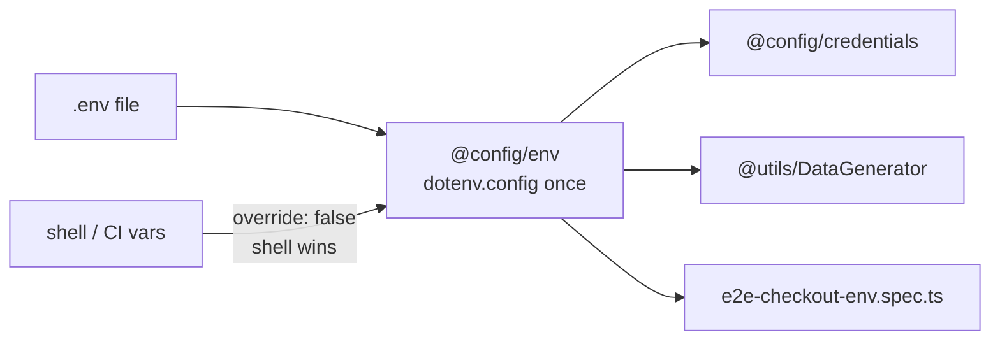

```ts
import { assertEnv, requireEnv, envOr } from '@config/env';

assertEnv('STANDARD_USER', 'TTA_SECRET');          // fail fast, values read elsewhere
const ITEM_ID = requireEnv('CHECKOUT_ITEM_ID');    // required
const zip = envOr('CHECKOUT_POSTAL_CODE', '560001'); // optional with fallback
```

### visualStep

**Concept:** `src/utils/visualStep.ts` wraps `test.step`. When `ATTACH_SCREENSHOTS=true`, it takes a screenshot at the end of the step and attaches it so the TTA reporter can show it next to that step.

**Why:** Playwright's built-in `test.step` has no screenshot. Checkout specs use `visualStep` so the HTML report can replay each checkout stage visually without enabling screenshots for every locator click.

```ts
import { visualStep } from '@utils/visualStep';

await visualStep(page, 'Open the cart', async () => {
    await cartPage.open();
});
```

### Custom TTA Reporter

**Concept:** `CustomTTAReporter` generates a self-contained HTML report (`tta-report/`) with real-time updates during the run. When `ATTACH_SCREENSHOTS=true`, it embeds step and failure screenshots. It also embeds video (always), trace zip files (always), step-level timelines, console logs, and three AI-powered tabs: AI Data, AI Verdict (RCA), and Flaky analysis.

**Why:** Playwright's built-in HTML reporter is a flat table. The TTA reporter adds expandable step details with video timestamps, per-step screenshots, inline console output, filterable tags, and an AI verdict pipeline for root-cause analysis on failures.

**Q&A - why use this?**

- **Q: How is it wired in?** A: Listed as a reporter path in `playwright.config.ts`: `['./src/utils/CustomReporter.ts']`. No CLI flag needed.
- **Q: Do the AI tabs work out of the box?** A: The Flaky tab diffs two consecutive runs without any API key. RCA and AI Data tabs need an LLM key set in `src/ai/config/providers.ts`.
- **Q: Where does the report live after a run?** A: `tta-report/report_<runId>.html`. An `index.html` redirect always points to the latest.

| Artifact  | Playwright Config     | TTA Report Behaviour            |
|:----------|:----------------------|:--------------------------------|
| Screenshot | Controlled by `ATTACH_SCREENSHOTS` | Disabled by default; when enabled, failure and `visualStep` screenshots are copied to `tta-report/screenshots/` |
| Video     | `on`                  | Copied to `tta-report/videos/`, embedded as `<video>` in detail panel |
| Trace     | `on`                  | Copied to `tta-report/traces/`, downloadable with step timestamps |

### API Testing (`src/tests/apisTests/`)

**Concept:** API specs live under `src/tests/apisTests/` and run in their own Playwright project named `api`, which pins `baseURL` to `API_BASE_URL` and omits `devices[...]` so no browser starts. The `chromium` project sets `testIgnore: '**/apisTests/**'` so the same files are never collected twice.

**Why:** The two suites need different hosts and only one needs a browser. Without the `testIgnore`, every API spec would also run under `chromium`, sending relative paths like `/booking` to the UI host and parsing an HTML error page as JSON.

**Q&A - why use this?**

- **Q: When do I reach for it?** A: Any test that asserts on HTTP status or a response body. Put the file under `src/tests/apisTests/` and it runs browser-free.
- **Q: What does it replace?** A: A single project with one `baseURL`, which forces every API call to spell out an absolute URL and still pays for a Chrome launch.
- **Q: What's the gotcha?** A: The project split is what makes relative paths work. Move a spec out of `apisTests/` and `request.get('/ping')` silently retargets the UI host, returning 200 where the API returns 201.

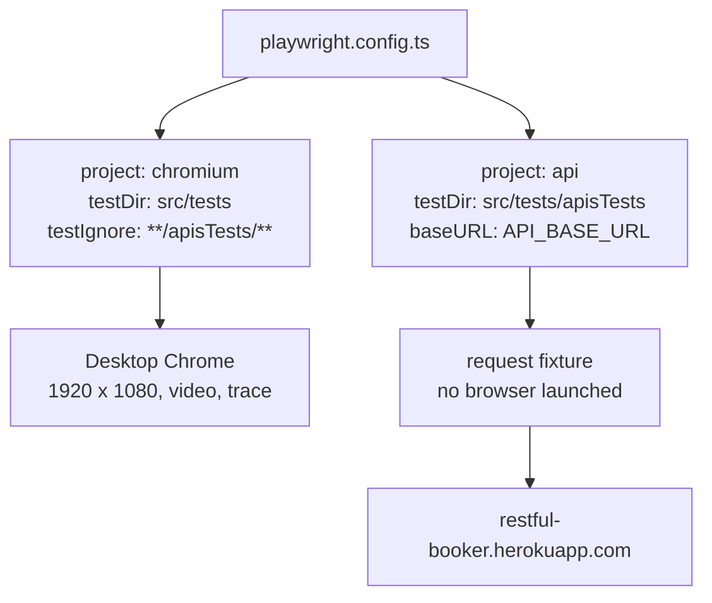

```bash
npx playwright test --project=api        # HTTP only, no browser
npx playwright test --project=chromium   # UI only, headed Chrome
npx playwright test --project=api --list # what will be collected
```

The suite is a deliberate four-level progression. Each level solves a problem the previous one exposed:

| Level | Folder | Teaches | Still hard |
|:------|:-------|:--------|:-----------|
| 1 | `01_restfulbooker_raw/` | Raw `request` fixture, status codes, `test.step` vs `describe.serial` | Every spec repeats headers, URLs, and JSON parsing |
| 2 | `02_restfulbooker_apiHelper/` | `ApiHelper` wraps the five verbs behind one call | Specs still know about tokens and endpoint paths |
| 3 | `03_restfulbooker_fixture_e2e_api/` | `BookingApi` service object, a fixture that mints the token, self-renewing auth, and negative paths | Reading deep response fields by hand |
| 4 | `04_jsonpath_plus/` | `JSONPath` queries instead of manual property chains | Reads are still per-field; nothing checks the response as a whole |
| 5 | `05_ajv_json_schema/` | `SchemaValidator` checks the whole response against a JSON Schema at runtime | - |

### 01 - Raw API specs

**Concept:** Five specs that call restful-booker through Playwright's built-in `request` fixture with nothing in between, so the HTTP is fully visible.

**Why:** Before hiding anything behind a helper, you need to see the headers, the `Cookie: token=` auth, and the exact status codes the API actually returns.

**Q&A - why use this?**

- **Q: When do I reach for it?** A: Learning a new API, or debugging a helper you no longer trust. Raw specs have no layer that can lie to you.
- **Q: What does it replace?** A: Nothing yet. This is the baseline the other three levels improve on.
- **Q: What's the gotcha?** A: `01_basic_ping` asserts **201**, not 200. That looks wrong and is right: restful-booker's `/ping` genuinely returns 201.

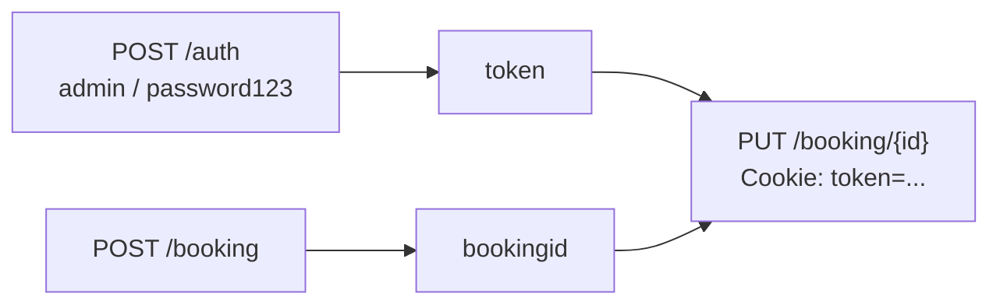

```ts
test('TC#3 @p0 - Update booking', async ({ request }) => {
    const responseData = await request.put(`${baseUrl}/booking/${bookingId}`, {
        headers: { ...headers, Cookie: `token=${token}` },
        data: payload,
    });
    expect(responseData.status()).toBe(200);
});
```

`04_put_operation.spec.ts` and `05_crud.spec.ts` show the two ways to sequence a dependent flow. Steps inside one test always run in order and share local variables. Separate tests need `describe.serial`, explicit shared state, and a guard that throws when an earlier test did not populate it. Use `describe.serial` when each stage should pass or fail on its own; use `test.step` when the stages are only meaningful together.

### 02 - ApiHelper (`@utils/ApiHelper`)

**Concept:** `ApiHelper` wraps `APIRequestContext` behind one `callApi()` switch plus `get/post/put/patch/delete` shortcuts, a query-string builder, a typed `parseJsonResponse<T>()`, and `isSuccess()` / `isFailureClient()` status predicates.

**Why:** Level 1 repeats the same headers, URL concatenation, and `await response.json()` cast in every spec. One typo in a header object fails a test for a reason that has nothing to do with the endpoint.

**Q&A - why use this?**

- **Q: When do I reach for it?** A: The moment a second spec needs the same verb against the same API.
- **Q: What does it replace?** A: Hand-rolled `request.post(url, { headers, data })` calls and the untyped `await res.json()` cast that follows each one.
- **Q: What's the gotcha?** A: It accepts a `Page` **or** an `APIRequestContext`. `getRequest()` unwraps `page.request` when handed a `Page`, so a UI test can reuse the browser's cookie jar for an API call.

```mermaid
flowchart TD
    S["spec"] --> H["ApiHelper"]
    H --> G["getRequest&#40;&#41;<br/>Page -> page.request"]
    H --> U["buildUrl&#40;url, params&#41;"]
    G --> CA["callApi&#40;&#41;"]
    U --> CA
    CA --> RES["APIResponse"]
    RES --> P["parseJsonResponse&lt;T&gt;&#40;&#41;"]
    RES --> OK["isSuccess&#40;&#41;"]
```

```ts
import { ApiHelper } from '@utils/ApiHelper';

const api = new ApiHelper(request);
const response = await api.post('/booking', payload);

expect(api.isSuccess(response)).toBe(true);
const body = await api.parseJsonResponse<CreateBookingResponse>(response);
expect(body.bookingid).toBeGreaterThan(0);
```

`parseJsonResponse<T>()` is a **cast, not a check**: the type is erased at compile time, so a response missing `bookingid` still satisfies it at runtime. [Level 05](#05---json-schema-validation-ajv) adds the runtime counterpart.

`callApiWithRetry()` polls until a caller-supplied `condition(response)` returns true, defaulting to 3 attempts 5s apart. Use it for endpoints that are eventually consistent, not to paper over a flaky assertion.

### 03 - Service object and fixture (`BookingApi` + `booker.fixture`)

**Concept:** `src/api/BookingApi.ts` turns the raw endpoints into named methods (`auth`, `createBooking`, `getBooking`, `updateBooking`, `patchBooking`, `deleteBooking`) that throw on non-2xx. `src/fixtures/booker.fixture.ts` exposes it as a `bookingApi` fixture plus a `bookerToken` fixture that mints a token via `POST /auth`.

**Why:** Level 2 specs still open with the same auth handshake. Moving token generation into a fixture means a test that needs auth just asks for `bookerToken` and Playwright runs the handshake lazily, once.

**Q&A - why use this?**

- **Q: When do I reach for it?** A: Any multi-step flow, and anything needing a token. Requesting `bookerToken` is one word versus five lines of auth setup.
- **Q: What does it replace?** A: Per-spec `beforeAll` blocks that POST to `/auth` and stash a token in a module-level variable.
- **Q: What's the gotcha?** A: `deleteBooking()` returns the raw status instead of throwing, because restful-booker answers a successful DELETE with **201**, not 204. Use `getBookingResponse()` for the same reason when you want to assert a 404.

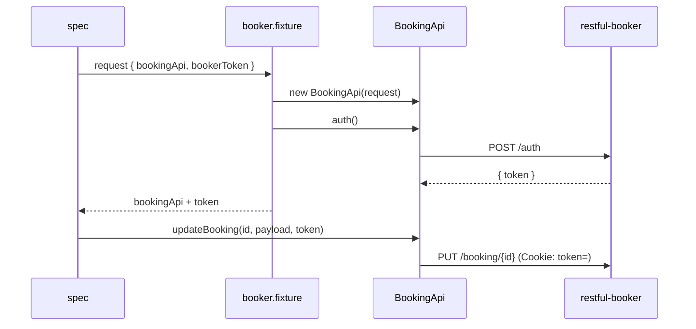

```ts
import { test, expect } from '@fixtures/booker.fixture';
import { buildBooking } from '@testdata/booking.data';

test('update the booking (token comes from the fixture)', async ({ bookingApi, bookerToken }) => {
    const updated = await bookingApi.updateBooking(
        bookingId,
        buildBooking({ firstname: 'E2E', lastname: 'Updated', totalprice: 950 }),
        bookerToken,
    );
    expect(updated.lastname).toBe('Updated');
});
```

### The same lifecycle, twice (`booking-crud-end-to-end.ponytail.spec.ts`)

**Concept:** A second copy of the lifecycle spec sits beside the original, covering the same create,
update, read-back, and delete in 33 lines instead of 73. Both run; they are kept together on purpose
so the diff is readable.

**Why:** Most of what a spec accumulates is machinery that reports something the tooling already
reports, and that is easier to see side by side than to describe.

**Q&A - why use this?**

- **Q: When do I reach for it?** A: When reviewing your own spec. Ask of each line whether anything
  else in the run already records it.
- **Q: What does it replace?** A: `test.step` wrappers, response attachments, and log lines that
  restate their own step names.
- **Q: What's the gotcha?** A: The cuts are only safe because `playwright.config.ts` sets
  `trace: 'on'`. Turn tracing off and the attachments stop being redundant.

| Cut | Why it was safe |
|:----|:----------------|
| `test.step` around single calls | The trace already lists every request with timings |
| `testInfo.attach` of the body | Same trace already holds it |
| Ten `log.info` lines | Each restated its own step name |
| `buildBooking` | `buildBookingFromGenerator` gives ordered, today-relative dates |
| Explicit `bookerToken` | Omitting it routes through the managed path, which re-auths on a 403 |

```mermaid
flowchart LR
    O["booking-crud.e2e.spec.ts<br/>73 lines"] --> C{"does the run<br/>already record it?"}
    C -->|"trace: 'on' logs it"| D["cut: steps, attachments, logs"]
    C -->|"no, it is the assertion"| K["keep: every expect&#40;&#41;"]
    D --> P["ponytail spec<br/>33 lines, 3 tests"]
    K --> P
```

```ts
test('update the booking, then read it back', async ({ bookingApi }) => {
    // No token argument: BookingApi re-auths on a 403 and retries. Passing one opts out.
    const updated = await bookingApi.updateBooking(
        bookingId,
        buildBookingFromGenerator({ firstname: 'E2E', lastname: 'Updated', totalprice: 950 }),
    );
    expect(updated).toMatchObject({ lastname: 'Updated', totalprice: 950 });

    // The GET, not the PUT echo, is what proves it persisted.
    expect((await bookingApi.getBooking(bookingId)).lastname).toBe('Updated');
});
```

Both files keep three tests. Test granularity was left alone deliberately: `describe.serial` reports
each stage as its own pass or fail, and that is a design decision about reporting, not machinery to
trim. Every `expect` survived for the same reason.

### Token renewal (`BookingApi.sendAuthed`)

**Concept:** `BookingApi` caches the token it mints and routes every authenticated call through `sendAuthed()`. When the API answers **403**, it re-auths once and replays the request.

**Why:** A fixture resolves once, before the test body runs, so it cannot repair a token that expires mid-test or that another run invalidated server-side. The recovery has to sit where the response is actually seen.

**Q&A - why use this?**

- **Q: When do I reach for it?** A: Omit the `token` argument on `updateBooking`, `patchBooking`, or `deleteBooking`. That is the managed path, and it renews itself.
- **Q: What does it replace?** A: A `beforeAll` that mints one token and a run that dies with a 403 an hour later.
- **Q: What's the gotcha?** A: Passing a token explicitly **opts out** of renewal. That is deliberate: a negative test asserting 403 must not have its bad token silently swapped for a good one.

```mermaid
flowchart TD
    S["updateBooking&#40;id, payload&#41;"] --> Q{"token argument passed?"}
    Q -->|"yes, caller owns it"| SEND1["send as-is"] --> RET["return response<br/>403 surfaces to the test"]
    Q -->|"no, managed"| G["getToken&#40;&#41;"] --> SEND2["send"]
    SEND2 --> C{"status 403?"}
    C -->|no| OK["return response"]
    C -->|yes| R["getToken&#40;true&#41;<br/>re-auth"] --> SEND3["retry once"] --> OK
```

```ts
// the whole lifecycle: `??=` mints once, then reuses, and skips auth() on a hit
async getToken(forceRefresh = false): Promise<string> {
    if (forceRefresh) this.invalidateToken();
    return (this.cachedToken ??= await this.auth());
}

// managed: renews on a 403 and retries, no token plumbing in the spec
await bookingApi.updateBooking(bookingId, payload);

// explicit: sent verbatim, 403 comes back untouched so it can be asserted
const response = await bookingApi.updateBookingResponse(bookingId, payload, 'not-a-real-token');
expect(response.status()).toBe(403);
```

Renewal is capped at one retry. A second 403 is a real failure (wrong credentials, or a rejection unrelated to token freshness) and is surfaced rather than looped on.

### Negative API tests (`booking-negative.spec.ts`)

**Concept:** Six specs covering the failure paths for create, read, update, and auth, asserting the status codes restful-booker **actually** returns rather than the ones a well-behaved API would. The four plain status checks are table-driven, so adding a case is one line.

**Why:** A suite that only walks the happy path cannot tell a working service from one that returns 200 with an error body. These are the assertions that catch a silent auth regression.

**Q&A - why use this?**

- **Q: When do I reach for it?** A: Alongside every happy-path flow. If a write can be rejected, prove the rejection is real and that nothing was written.
- **Q: What does it replace?** A: `try { ... } catch (e) { }` blocks that swallow the failure and pass regardless.
- **Q: What's the gotcha?** A: The service object throws on non-2xx, which is wrong for a negative test. Use the raw `getBookingResponse()` / `createBookingResponse()` / `updateBookingResponse()` variants to assert a status, or `.rejects.toThrow()` to assert the error contract.

| Case | Expected | Guessing would say |
|:-----|:---------|:-------------------|
| `GET /booking/{unknown id}` | 404 | 404 |
| `GET /booking/abc` (non-numeric) | 404 | 400 |
| `POST /booking` missing fields | **500** | 400 Bad Request |
| `POST /booking` empty body | **500** | 400 Bad Request |
| `PUT /booking/{id}` bad token | **403** | 401 Unauthorised |
| `POST /auth` bad credentials | **200** + `{ reason }` | 401 Unauthorised |

```mermaid
flowchart LR
    N["negative spec"] --> RAW["raw *Response&#40;&#41; methods"] --> ST["assert status"]
    N --> TYPED["typed methods"] --> TH["assert .rejects.toThrow&#40;&#41;"]
```

```ts
const REJECTIONS: [name: string, call: (api: BookingApi) => Promise<{ status(): number }>, status: number][] = [
    ['GET unknown id -> 404', (api) => api.getBookingResponse(99_999_999), 404],
    ['GET non-numeric id -> 404', (api) => api.getBookingResponse('abc' as unknown as number), 404],
    ['POST partial payload -> 500', (api) => api.createBookingResponse({ firstname: 'X' }), 500],
    ['POST empty body -> 500', (api) => api.createBookingResponse({}), 500],
];

for (const [name, call, status] of REJECTIONS) {
    test(name, async ({ bookingApi }) => {
        expect((await call(bookingApi)).status()).toBe(status);
    });
}
```

Asserting the status is only half a negative test. The read-back is what proves the rejected write did not partially apply.

### 04 - JSONPath queries (`jsonpath-plus`)

**Concept:** `JSONPath({ path, json })` pulls values out of a response by expression instead of by property chain, and **always returns an array**, even for a single match.

**Why:** Asserting on a deep field means either a long optional-chaining expression or a loop. One path string replaces both, and reads the same whether the target is one level deep or five.

**Q&A - why use this?**

- **Q: When do I reach for it?** A: Deeply nested fields, or when you want every match of a key at unknown depth via `$..key`.
- **Q: What does it replace?** A: `body.booking.bookingdates.checkin` chains and `array.filter(...).map(...)` over response lists.
- **Q: What's the gotcha?** A: The array wrapper. `JSONPath({ path: '$.bookingid', json })` gives `[42]`, not `42`, so index `[0]` or pass `wrap: false`.

```mermaid
mindmap
  root((JSONPath))
    Root
      $ whole document
      @ current item in a filter
    Descend
      . child
      .. recursive descent
      * wildcard
    Arrays
      "[0] index"
      "[-1:] slice"
      "[?(@.x > 0)] filter"
```

```ts
import { JSONPath } from 'jsonpath-plus';

const body = await bookingApi.createBooking(payload);

// deep value without manual chaining
const checkin = JSONPath({ path: '$.booking.bookingdates.checkin', json: body })[0];

// every totalprice at any depth, one expression, zero loops
expect(JSONPath({ path: '$..totalprice', json: body })).toEqual([540]);

// filter an array response: only ids greater than zero
const list = await bookingApi.getAllBookings();
const positives = JSONPath({ path: '$[?(@.bookingid > 0)]', json: list });
```

A full syntax reference with runnable examples lives in [`jsonpath-cheatsheet.md`](src/tests/apisTests/04_jsonpath_plus/jsonpath-cheatsheet.md), backed by the sample document [`store.json`](src/tests/apisTests/04_jsonpath_plus/store.json).

### 05 - JSON schema validation (`ajv`)

**Concept:** `SchemaValidator` checks a live response against a JSON Schema file at runtime, so a dropped, renamed, or retyped field fails the test instead of slipping through.

**Why:** A TypeScript `interface` is erased at compile time, so `parseJsonResponse<CreateBookingResponse>()` is a cast, not a check. A response missing `bookingid` entirely still satisfies that type at runtime.

**Q&A - why use this?**

- **Q: When do I reach for it?** A: Once per endpoint, on the response body. It covers every field at once, so you stop writing a `expect(...).toBeTruthy()` per key.
- **Q: What does it replace?** A: Per-spec interfaces plus a handful of field assertions that only cover the two or three fields that test happened to care about.
- **Q: What's the gotcha?** A: A green schema test does not prove the schema is right. An empty schema `{}` validates everything, so confirm a new schema fails when you deliberately break one field before trusting it.

The schema is strict at every level (`additionalProperties: false` on the root, on `booking`, and on `bookingdates`), so an unannounced new field fails the build rather than passing silently. It checks shape only, types plus required keys, with no value constraints, so it stays readable. `additionalneeds` is in `properties` but deliberately **not** in `required`: it is absent on a real share of live bookings, so requiring it would fail at random.

```mermaid
flowchart TD
    R["POST /booking response"] --> V["SchemaValidator.assertValid&#40;&#41;"]
    S["create-booking.schema.json"] --> C["ajv.compile&#40;&#41;<br/>cached per schema"]
    C --> V
    F["ajv-formats"] -.->|"enables format: date"| C
    V --> OK["valid -> test continues"]
    V --> BAD["invalid -> throw listing<br/>every violation at once"]
```

```ts
import createBookingSchema from '@testdata/schemas/create-booking.schema.json';
import { SchemaValidator } from '@utils/SchemaValidator';

test('@P0 @schema Level 5 - POST /booking matches the create-booking schema', async ({ bookingApi }) => {
    const body = await bookingApi.createBooking(buildBookingFromGenerator());

    // one call covers every field in the response
    SchemaValidator.assertValid(createBookingSchema, body, 'POST /booking');

    await bookingApi.deleteBooking(body.bookingid);
});
```

`validate()` is the non-throwing counterpart, returning `{ valid, errors }` when you would rather assert on the result than fail on it.

Failures name the field, because Ajv's raw `ErrorObject`s do not:

```
[SchemaValidator] POST /booking does not match schema:
  - /booking/totalprice must be string
```

Missing and extra-property errors arrive with an empty `instancePath`, so `SchemaValidator.describe()` splices the key out of `params` to produce `/booking/discount must NOT have additional properties` rather than a bare `must NOT have additional properties`.

Two Ajv details worth knowing. The schema is **draft-07**: Ajv 8's default export only understands draft-07, and a `$schema` of `2020-12` needs the separate `ajv/dist/2020` entry point or it throws `no schema with key or ref`. And `"format": "date"` does nothing until `ajv-formats` is registered, which is why the util wraps its instance in `addFormats(new Ajv({ allErrors: true }))`.

### Booking test data (`@testdata/booking.data`)

**Concept:** Two builders return the same `Booking` shape with every field overridable. Both go through [`DataGenerator`](#datagenerator), so random data has a single source; `buildBooking()` additionally pins check-in to `PINNED_CHECKIN` for specs that assert on a known date.

**Why:** Hard-coded payloads make two tests collide on the same data, and a payload written inline cannot be partially pinned without retyping every field.

**Q&A - why use this?**

- **Q: When do I reach for it?** A: Every create or update call. Pin only the fields you assert on and let the rest vary.
- **Q: What does it replace?** A: Inline object literals copied between specs, which drift apart the moment the API adds a field.
- **Q: What's the gotcha?** A: The two builders differ only in check-in. `buildBooking` pins it to `PINNED_CHECKIN` (`2026-02-01`) because `jsonpath-queries.e2e.spec.ts` asserts on that literal, so the constant cannot be changed casually. `buildBookingFromGenerator` anchors to today so bookings never age into the past. Both derive check-out from check-in, so a stay can never come out reversed.

```mermaid
flowchart LR
    F["@faker-js/faker"] --> DG["DataGenerator<br/>number / bool / dateOffset / oneOf"]
    DG --> B2["buildBookingFromGenerator&#40;&#41;<br/>checkin = today + 1"]
    B2 --> B1["buildBooking&#40;&#41;<br/>overrides checkin to PINNED_CHECKIN"]
    B1 --> S["spec payload"]
    B2 --> S
    DG -.->|"dateOffset&#40;nights, checkin&#41;"| CO["checkout always after checkin"]
```

```ts
import { buildBooking, buildBookingFromGenerator } from '@testdata/booking.data';

// everything random, check-in is tomorrow, check-out three nights later
const booking = buildBookingFromGenerator();

// pin what you assert on, vary the rest; second arg sets the stay length
const longStay = buildBookingFromGenerator({ firstname: 'Pramod', totalprice: 950 }, 7);

// check-in pinned to 2026-02-01, check-out still derived from it
const pinned = buildBooking();
```

A Postman collection covering the same endpoints, including cases not yet automated, is committed at [`docs/postman_api_collection/`](docs/postman_api_collection/) for manual exploration.

## Project Structure

```
.
├── .claude/
│   ├── commands/
│   │   └── gogo.md        # /gogo: update README, commit, push
│   └── skills/            # 12 agent skills, read by Claude Code AND Copilot
├── .github/
│   ├── copilot-instructions.md  # Repo-wide rules for GitHub Copilot
│   └── workflows/         # CI pipeline (GitHub Actions)
├── .env.example           # Committed template; CI copies it to .env
├── docs/
│   ├── Playwright-Worker.md     # Parallel workers: measured timings, RAM per worker
│   └── postman_api_collection/  # Restful Booker collection, incl. PATCH/DELETE
├── learnings/
│   ├── NewFeature.md      # How the .env feature was built, step by step
│   └── *.md               # Implementation notes (reporter wiring, dotenv, testDir scoping)
├── rules/                 # Project/test rules and conventions
├── src/
│   ├── ai/
│   │   ├── agents/        # RCA and Flaky AI analysis agents
│   │   └── config/        # LLM provider configuration
│   ├── api/
│   │   └── BookingApi.ts  # Booking service object; caches and renews its token
│   ├── config/
│   │   ├── credentials.ts # STANDARD_USER / TTA_SECRET with demo fallbacks
│   │   └── env.ts         # Loads .env once; requireEnv / envOr / assertEnv
│   ├── fixtures/
│   │   ├── booker.fixture.ts # bookingApi + bookerToken for API specs
│   │   └── test-base.ts   # Page-object and composable state fixtures
│   ├── pages/             # Page Object Model classes
│   │   ├── BasePage.ts    # Shared scaffolding (page, el, log, goto)
│   │   ├── LoginPage.ts   # Login screen with data-test locators
│   │   ├── InventoryPage.ts
│   │   ├── CartPage.ts
│   │   ├── CheckoutStepOnePage.ts
│   │   ├── CheckoutStepTwoPage.ts
│   │   ├── CheckoutCompletePage.ts
│   │   └── ItemDetailPage.ts
│   ├── testdata/
│   │   ├── schemas/
│   │   │   └── create-booking.schema.json # Draft-07, strict, additionalneeds optional
│   │   ├── booking.data.ts    # buildBooking + buildBookingFromGenerator
│   │   └── logintestdata.json # Valid and negative login accounts
│   ├── tests/
│   │   ├── apisTests/     # Collected by the `api` project, never by chromium
│   │   │   ├── 01_restfulbooker_raw/        # Raw `request` fixture, 5 specs
│   │   │   ├── 02_restfulbooker_apiHelper/  # Same calls through ApiHelper
│   │   │   ├── 03_restfulbooker_fixture_e2e_api/
│   │   │   │   ├── booking-crud.e2e.spec.ts  # Happy-path lifecycle
│   │   │   │   ├── booking-crud-end-to-end.ponytail.spec.ts # Same, 33 lines
│   │   │   │   └── booking-negative.spec.ts  # 404 / 500 / 403 / bad creds
│   │   │   ├── 04_jsonpath_plus/            # JSONPath queries + cheatsheet
│   │   │   └── 05_ajv_json_schema/          # Runtime contract checks via Ajv
│   │   ├── e2e/
│   │   │   ├── e2e-checkout.spec.ts              # Full checkout via visualStep
│   │   │   ├── e2e-checkout-env.spec.ts          # Same flow, every input from .env
│   │   │   └── e2e-checkout_new_fixture.spec.ts  # Fixture-driven login + checkout
│   │   └── login/
│   │       └── login.spec.ts  # Login flow with @p0 smoke tag
│   └── utils/
│       ├── CustomReporter.ts    # TTA HTML reporter with AI tabs
│       ├── DataGenerator.ts     # Faker-based test data (checkoutCustomer, etc.)
│       ├── KBlogger.md          # Supported logger levels and examples
│       ├── SchemaValidator.ts   # Ajv runtime response validation
│       ├── ApiHelper.ts         # Generic GET/POST/PUT/PATCH/DELETE wrapper
│       ├── UtilElementLocator.ts # Logged locator wrapper (Flex type)
│       ├── visualStep.ts        # Optional per-step screenshot attachments
│       └── logger.ts            # Winston scoped logger
├── playwright.config.ts   # Playwright configuration
├── tsconfig.json          # TypeScript configuration and path aliases
└── package.json
```

## Prerequisites

- Node.js (LTS recommended)
- npm

## Setup

Install dependencies and Playwright browsers:

```bash
npm install
npx playwright install
```

Create your `.env` from the committed template (this is exactly what CI does):

```bash
cp .env.example .env
```

`.env` itself is gitignored. `.env.example` is not, and it is the contract: if a key is required
and missing, the suite stops at collection with a message naming the key. Override defaults there
(see [Environment Configuration](#environment-configuration)):

```bash
TTA_ENV=qa
ATTACH_SCREENSHOTS=false
STANDARD_USER=standard_user
TTA_SECRET=tta_secret
BASE_URL=
QA_BASE_URL=https://app.thetestingacademy.com
STG_BASE_URL=https://stage.thetestingacademy.com
DEV_BASE_URL=http://localhost:3000
PROD_BASE_URL=https://app.thetestingacademy.com
API_BASE_URL=https://restful-booker.herokuapp.com
```

## Environment Configuration

The base URL is resolved in `playwright.config.ts` based on the `TTA_ENV` environment variable:

| `TTA_ENV` value          | Resolves to                                  |
|---------------------------|-----------------------------------------------|
| `qa` (default)            | `QA_BASE_URL` or `https://app.thetestingacademy.com` |
| `dev` / `local`           | `DEV_BASE_URL` or `http://localhost:3000`     |
| `stg` / `stage` / `staging` | `STG_BASE_URL` or `https://stage.thetestingacademy.com` |
| `prod` / `production`     | `PROD_BASE_URL` or `https://app.thetestingacademy.com` |
| `api`                     | `API_BASE_URL` or `https://restful-booker.herokuapp.com` |

`BASE_URL`, if set, always takes precedence over the above.

### Keys read by the suite

| Key | Read by | Required |
|:----|:--------|:---------|
| `STANDARD_USER` / `TTA_SECRET` | `@config/credentials` | Yes for `e2e-checkout-env.spec.ts` |
| `CHECKOUT_ITEM_ID` | `e2e-checkout-env.spec.ts` | Yes for that spec |
| `CHECKOUT_FIRST_NAME` / `CHECKOUT_LAST_NAME` / `CHECKOUT_POSTAL_CODE` | `DataGenerator.checkoutCustomerFromEnv()` | No, Faker fills any that are unset |
| `API_BASE_URL` | `api` project in `playwright.config.ts`, and the specs in `src/tests/apisTests/` | No, defaults to `https://restful-booker.herokuapp.com` |
| `LOG_LEVEL` | `@utils/logger` | No, defaults to `info` |
| `ATTACH_SCREENSHOTS` | `playwright.config.ts`, `@utils/visualStep` | No, defaults to `false` |
| `TEST_ENV` / `TEST_AUTHOR` | `CustomReporter` header | No |

A shell variable always beats the file, because dotenv's `override` is left at `false`. Use that to
prove a value is genuinely reaching the test:

```bash
CHECKOUT_FIRST_NAME=EnvProof npx playwright test src/tests/e2e/e2e-checkout-env.spec.ts
# the log must read customer="EnvProof ..."; if it still shows the .env value, nothing is flowing
```

Set `ATTACH_SCREENSHOTS=true` to attach screenshots for every `visualStep` and on test failures. The default is `false`, which disables both step and failure screenshot attachments.

## Path Aliases

TypeScript path aliases are configured in `tsconfig.json` for cleaner imports:

| Alias         | Maps to           |
|---------------|--------------------|
| `@api/*`      | `src/api/*`        |
| `@config/*`   | `src/config/*`     |
| `@fixtures/*` | `src/fixtures/*`   |
| `@pages/*`    | `src/pages/*`      |
| `@testdata/*` | `src/testdata/*`   |
| `@utils/*`    | `src/utils/*`      |

## Running Tests

Run the full suite:

```bash
npx playwright test
```

Run a specific test file:

```bash
npx playwright test src/tests/login/login.spec.ts
```

Run the fixture-driven checkout examples:

```bash
npx playwright test src/tests/e2e/e2e-checkout_new_fixture.spec.ts
```

Run only the API suite, or only the UI suite:

```bash
npx playwright test --project=api        # src/tests/apisTests, no browser launched
npx playwright test --project=chromium   # src/tests minus apisTests, headed Chrome
```

List what a project will collect without running anything. This is the cheapest way to tell a
config problem from a test problem, because a file missing from the listing was never collected:

```bash
npx playwright test --project=api --list
```

UI tests run in headed mode at a Full HD viewport (`1920 × 1080`) by default. API tests launch no
browser at all, so they ignore the viewport, video, and trace settings.

Run against a specific environment:

```bash
TTA_ENV=stage npx playwright test
```

Control parallelism:

```bash
npx playwright test --workers=4     # pin the worker count
npx playwright test --workers=1     # serial, for debugging a suite-only failure
npx playwright test --workers=50%   # a share of cores, portable across machines
```

`fullyParallel: true` splits tests **within** a file, not just file against file, so two tests in
one spec land on different workers. `test.describe.serial` caps a whole file at one worker no
matter what `--workers` says. See [`docs/Playwright-Worker.md`](docs/Playwright-Worker.md) for
measured timings, per-worker memory cost, and a worker-count table by system RAM.

View the HTML report:

```bash
npx playwright show-report
```

## Test Configuration

Defined in `playwright.config.ts`:

- Two projects: `chromium` (`testDir: src/tests`, `testIgnore: **/apisTests/**`) and `api` (`testDir: src/tests/apisTests`)
- Spec files must be named `*.spec.ts`; an underscore before `spec` is never collected
- Timeout: 60s per test, 10s per assertion
- Fully parallel execution
- Retries: 2 on CI, 0 locally
- Headed browser: always enabled
- Viewport: 1920 × 1080
- Screenshots: disabled by default; set `ATTACH_SCREENSHOTS=true` for `visualStep` and failure attachments
- Video: always recorded
- Trace: always captured
- Browser: Chromium (Desktop Chrome) for the `chromium` project only; the `api` project defines no `devices[...]` and starts no browser

## Continuous Integration

`.github/workflows/playwright.yml` runs on every push and pull request to `main`/`master`:

1. Checks out the repository
2. Sets up Node.js (LTS)
3. Installs dependencies (`npm ci`)
4. Installs Playwright browsers with OS dependencies
5. **Seeds `.env` with `cp .env.example .env`**
6. Runs the Playwright test suite under `xvfb-run` (required because UI tests run headed at 1920 × 1080)
7. Uploads the HTML report as a build artifact (30-day retention)

Step 5 is not optional. `.env` is gitignored, so the runner checks out a repo without one, and the
fail-fast checks in `@config/env` throw during test collection. That fails the **entire** run, not
just the specs that need those keys. Reproduce the runner's state locally before changing CI:

```bash
mv .env .env.bak && npx playwright test    # must fail the way CI would
cp .env.example .env && npx playwright test
mv .env.bak .env
```

When real credentials replace the demo values, swap the seeding step for an `env:` block backed by
GitHub Secrets. `STANDARD_USER` and `TTA_SECRET` are the keys `@config/credentials` reads.

A plain `npx playwright test` now runs both projects, so CI reaches two live third-party hosts
(`restful-booker.herokuapp.com` and `gorest.in`). Neither is under this project's control, so an
outage on either turns the build red without a code change. Split the job with `--project=` if UI
and API results need to fail independently.

## Agent Skills

**Concept:** `.claude/skills/` holds 12 agent skills: 11 adapted from the
[TheTestingAcademy Playwright pack](https://github.com/PramodDutta/skillmasterclass/tree/main/skillmasterclass/skills/framework-packs/playwright-pack),
plus one written for this repo. Each is a `SKILL.md` with YAML frontmatter that an agent loads only
when the task matches its description.

**Why:** The upstream pack is written for generic Playwright. These copies are rewritten against
*this* framework, so a generated spec imports from `@fixtures/test-base` rather than
`@playwright/test`, a Page Object extends `BasePage`, and API schema examples use `ajv` rather than
zod, which is not a dependency here.

**One directory, both tools.** GitHub Copilot reads project skills from `.github/skills`,
`.claude/skills`, or `.agents/skills`, so `.claude/skills/` serves Claude Code and Copilot with no
duplication. `.github/copilot-instructions.md` carries the same conventions for Copilot's inline
suggestions and chat, which do not load skills the same way.

| Skill | Use it for |
|:------|:-----------|
| `pw-page-object-builder` | A new Page Object following the `BasePage` contract |
| `pw-fixture-designer` | A new fixture, extending `test-base.ts` rather than adding a second module |
| `pw-test-generator` | A new spec in the house style |
| `pw-locator-fixer` | Replacing brittle selectors with `data-test` locators |
| `pw-api-tester` | API specs using `ajv` + `ajv-formats` + `jsonpath-plus` |
| `pw-network-mocker` | `page.route` stubbing, with the static-app caveat |
| `pw-flaky-debugger` | Intermittent failures, starting from `reports/runs/*.json` |
| `pw-trace-analyzer` | Reading a `trace.zip` or a CI failure |
| `pw-visual-regression` | Screenshot baselines (not set up in this repo yet) |
| `pw-accessibility-auditor` | axe checks (`@axe-core/playwright` not installed yet) |
| `pw-ci-configurator` | Editing `.github/workflows/playwright.yml` |
| `feature-explainer` | An ELI5 page plus hand-drawn whiteboard for a shipped change |

**Q&A - why use these?**

- **Q: How do I trigger one?** A: Describe the task in the words the skill's description lists, for example "make a page object for the cart" or "this test is flaky". The agent loads the matching skill itself. In Claude Code you can also invoke one by name.
- **Q: Do skills change if I edit them mid-session?** A: No. Skills are snapshotted at session start, so restart the session after editing one.
- **Q: What does `feature-explainer` produce?** A: One self-contained HTML file written to a scratch directory, never committed, with a verification script that renders it in both light and dark themes and fails on clipped diagrams, unloaded fonts, or sideways page scroll.

```
.claude/skills/
├── feature-explainer/
│   ├── SKILL.md
│   ├── assets/explainer-template.html   # page shell, tokens, both themes
│   ├── references/hand-drawn-svg.md     # rough-box / arrow / sticky recipes
│   └── scripts/verify-explainer.js      # renders and fails on real defects
└── pw-*/SKILL.md                        # 11 framework-adapted Playwright skills
```

## Slash Commands

`.claude/commands/gogo.md` defines `/gogo`: update this README for whatever changed, then stage,
commit, and push to `main`. Run it after a feature lands so the docs never drift behind the code.

```bash
/gogo                 # README + commit + push
/gogo skip readme     # commit and push only
```

## License

ISC